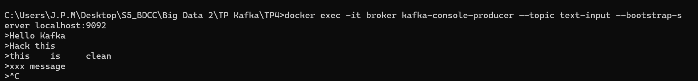
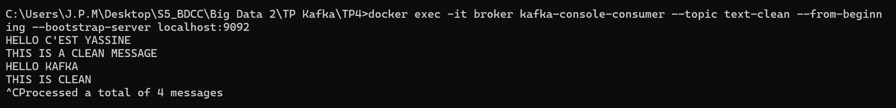
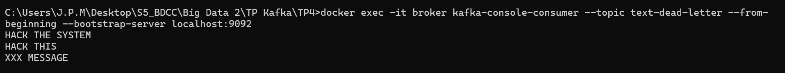
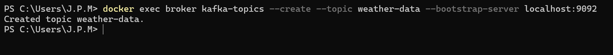
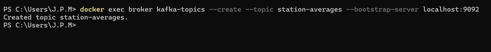
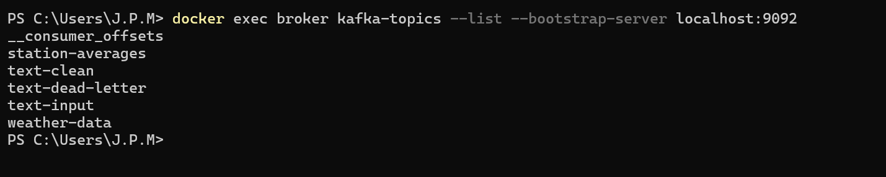
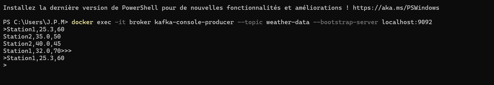
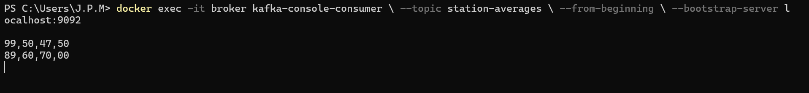

#  Stream processing avec Kafka Streams

[](https://www.java.com/)
[](https://kafka.apache.org/)
[](https://maven.apache.org/)

---

## Exercice 1: Traitement de messages texte
##  Objectif

Cette application **Kafka Streams** lit des messages texte depuis un topic Kafka `text-input`, les nettoie, et les redirige vers deux topics :

- `text-clean` → messages valides
- `text-dead-letter` → messages invalides

Les messages invalides sont ceux qui sont vides, contiennent des mots interdits (`HACK`, `SPAM`, `XXX`) ou dépassent 100 caractères.

---
## Tests

### Création des topics

```bash
docker exec broker kafka-topics --create --topic text-input --bootstrap-server localhost:9092
docker exec broker kafka-topics --create --topic text-clean --bootstrap-server localhost:9092
docker exec broker kafka-topics --create --topic text-dead-letter --bootstrap-server localhost:9092

```
### Envoi de messages dans text-input


### Vérification des messages valides (text-clean)


### Vérification des messages invalides (text-dead-letter)


## Exercice 2 : Analyse de Données Météorologiques

### Objectif

Cette application **Kafka Streams** lit des données météorologiques depuis le topic :

- `weather-data`

Chaque message est au format :
station,temperature,humidity

L’application effectue les traitements suivants :

1. **Lecture** des données météo (KStream)
2. **Filtrage** : conserver uniquement les températures *supérieures à 30°C*
3. **Conversion** : transformation des températures en **Fahrenheit**
4. **Agrégation par station** :
    - calcul de la température moyenne (°F)
    - calcul de l’humidité moyenne (%)
5. **Publication** des résultats agrégés dans le topic :
    - `station-averages`

---

##  Tests

### 1. Création des topics

```bash
docker exec broker kafka-topics --create --topic weather-data --bootstrap-server localhost:9092
docker exec broker kafka-topics --create --topic station-averages --bootstrap-server localhost:9092
```




### 2. Envoi de données dans weather-data
```bash
docker exec -it broker kafka-console-producer --topic weather-data --bootstrap-server localhost:9092
```


### 3. Vérification des résultats (topic station-averages)
```bash
docker exec -it broker kafka-console-consumer --topic station-averages --from-beginning --bootstrap-server localhost:9092
```



